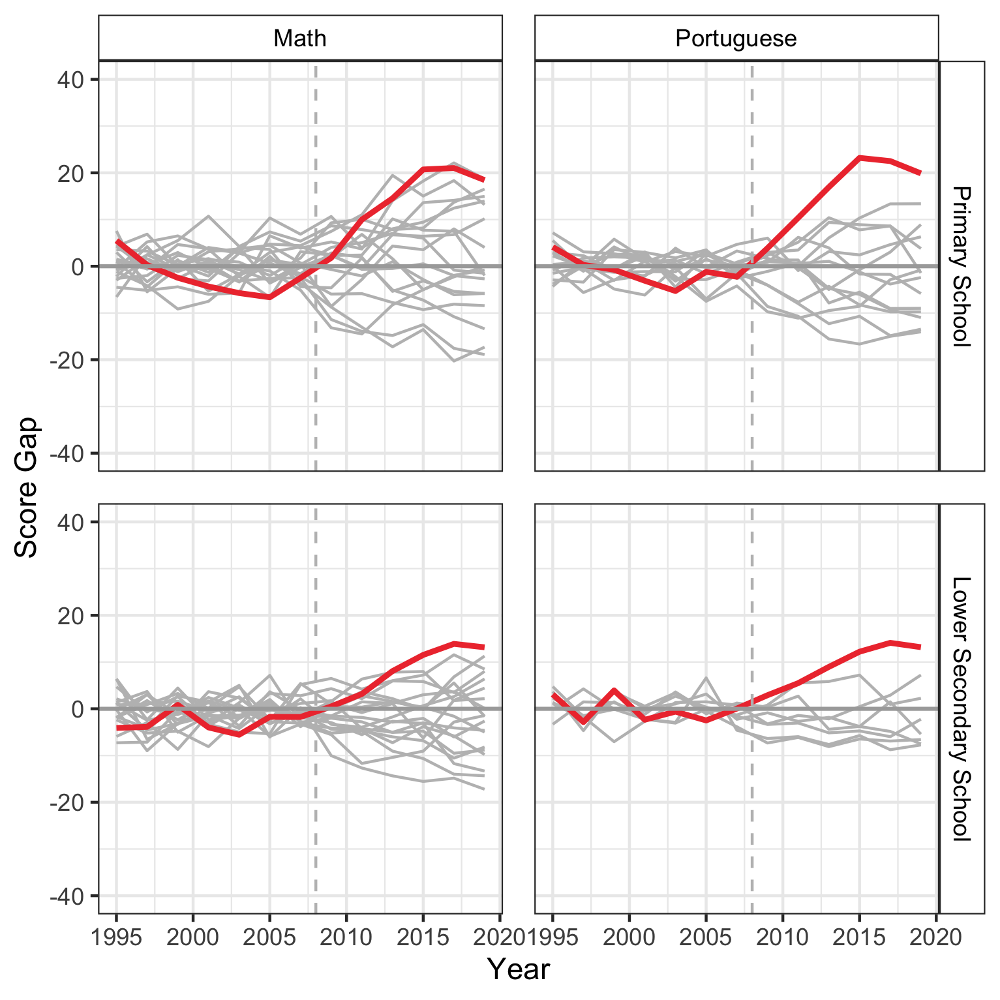

# :books: The Impact of Institutional Arrangements on Student Achievement: Evidence from Brazil

This repository includes all codes to replicate my master thesis *The Impact of Institutional Arrangements on Student Achievement: Evidence from Brazil* presented at the Hertie School, Berlin.

Abstract: Applying two causal inference methodologies, fixed-effects and synthetic control method, I examined the effect of the educational reforms implemented in Ceará, Brazil, to improve schooling quality.

This repository is divided in 5 R Scripts, each encompassing a section of the research, as follows:

### Script 01 - Analytical Sample Statistics

In this script, the code to compute the sample statistics is presented.

### Script 02 - Descriptive Satatistics

Here I present the main descriptive statistics. Plots were developed with ggplot. Density, dot, line and spatial plots explore the characteristics of the sample before and after the intervention.
Bellow, one example of graph shows the performance of students across states and time in Brazil.

### Script 03 - Fixed-effects Models

This section of code estimate the impact of the reforms employing the fixed-effect approach. The *Sandwich* library is used to estimate robust and clustered standard errors.

### Script 04 - Synthetic Control Method

The R library *Synth* is used in this script to estimate several synthetic controls. The functions *prepare_p_ls()* and *prepare_us()* (in the functions folder) are auxiliary to the estimation of the synthetic controls.

The authors of the package *Synth* provide a function to plot graphs in base R. However, since I wished to personalize my graphs, I developed the function *plot_scm()* that prepares the output of *Synth* to be used in ggplot.

Bellow is one example of graph plotted with this function and ggplot. It shows the trends in education performance for Ceará and its Synthetic version:

Here is another example that shows the permutation test employed to examine my findings regarding inference:

### Script 05 - Results

Finally, this code summarizes the results provided by the two different methods by ploting a coefficient plot.

### :exclamation: Important notes:

- To replicate my research, download this repository and open the R project in your computer. After that choose the script of interest and run it;
- All paths are already coded to load the necessary functions and data from the right folders;
- All necessary data is in the *data* and *map* folder.

